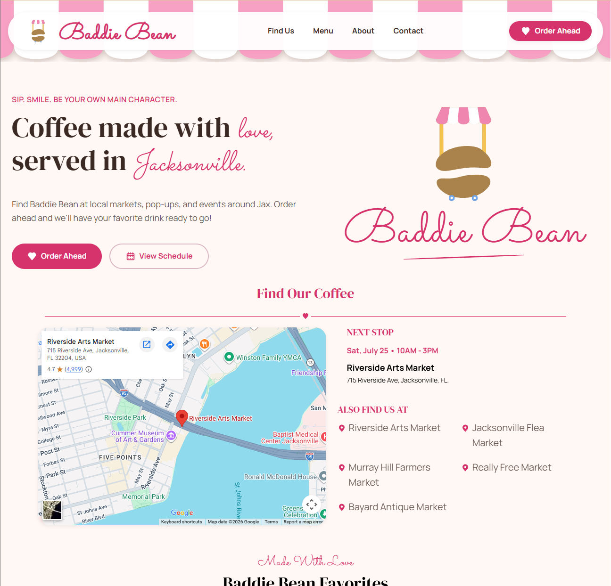
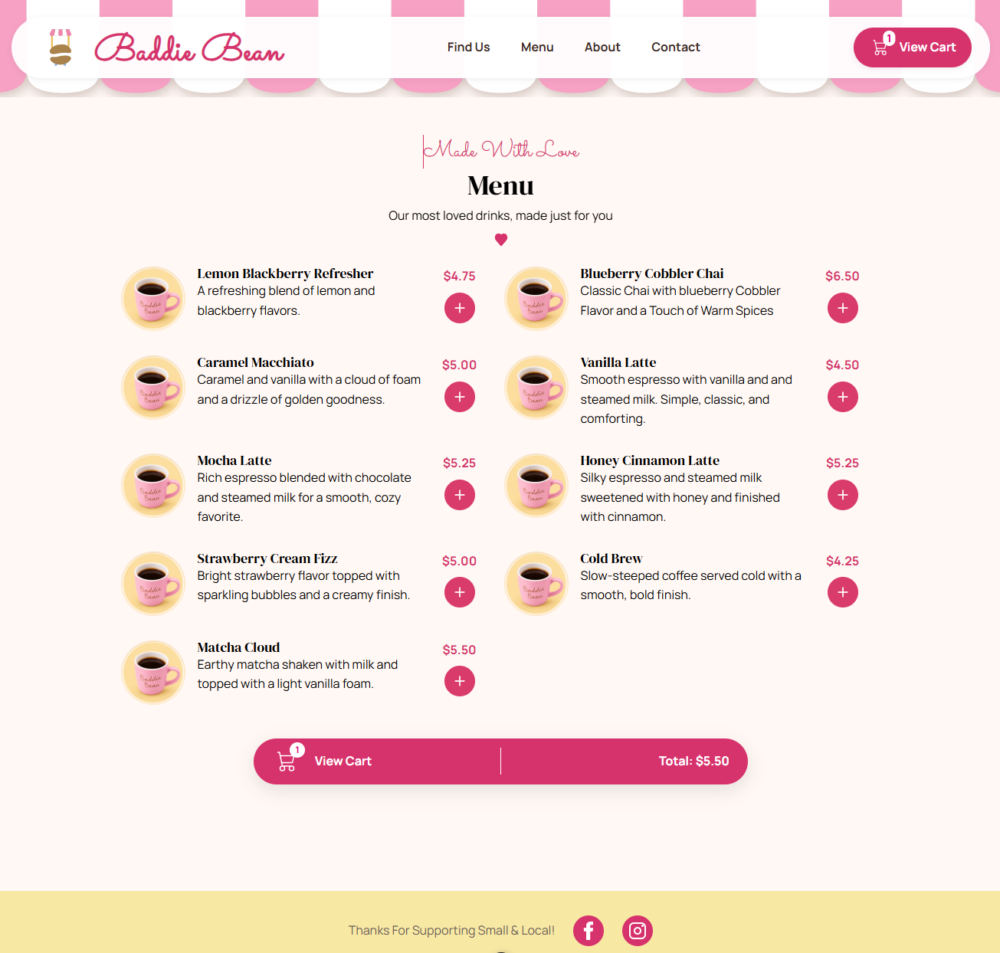
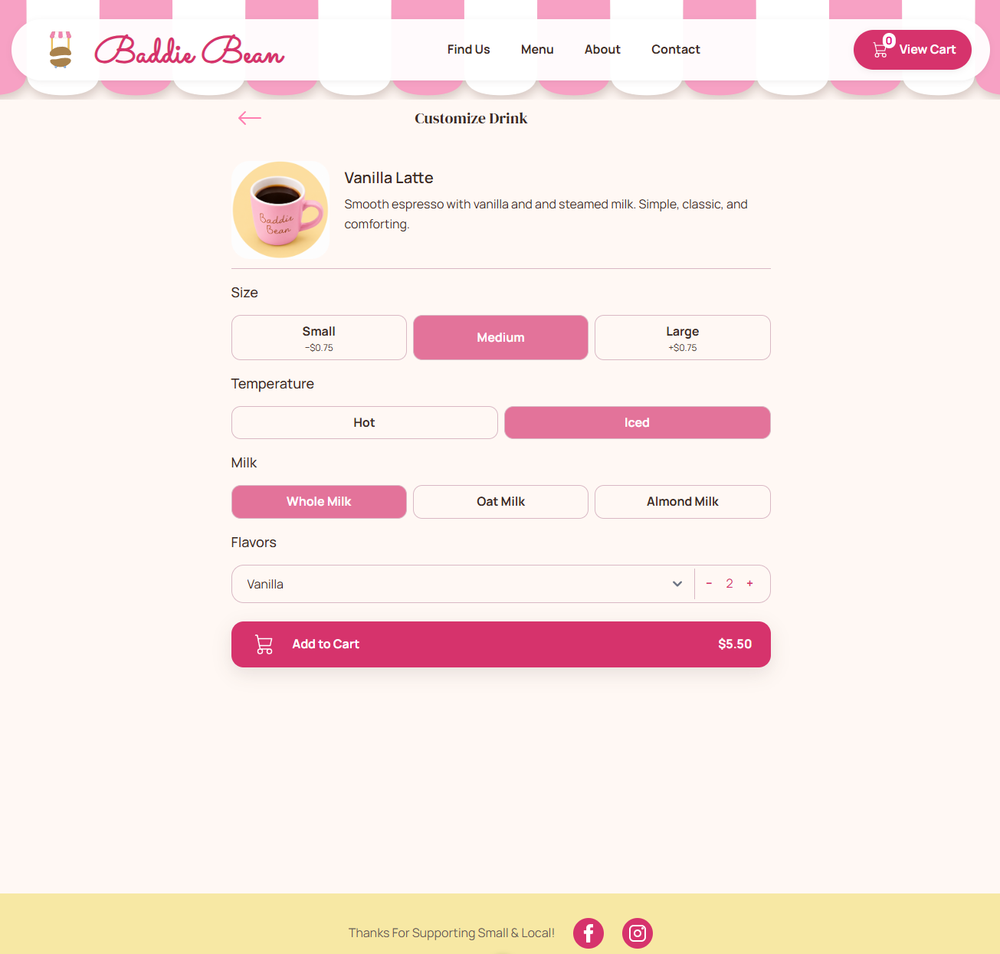
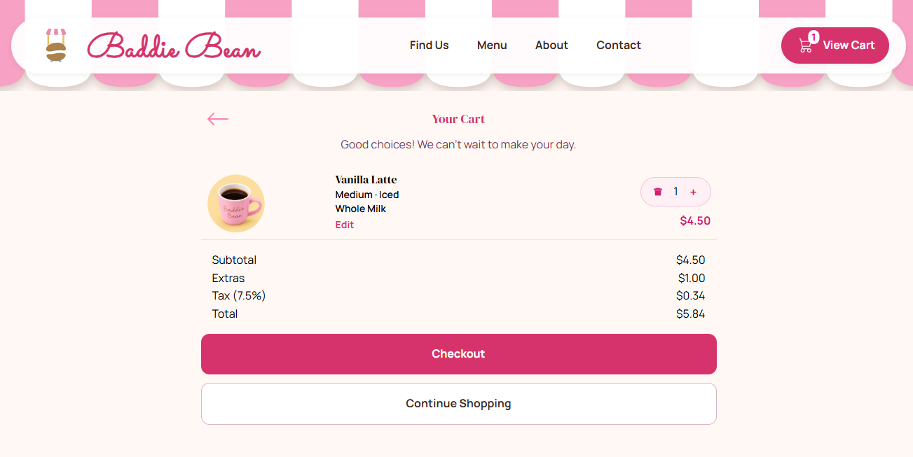
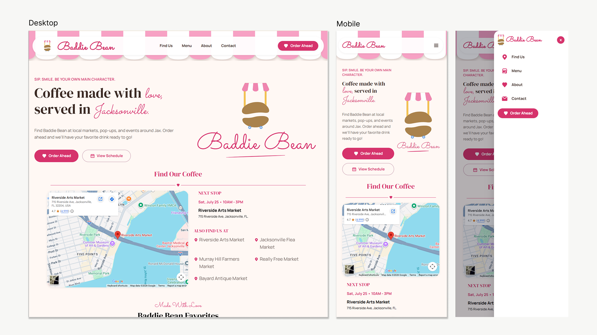

# Merica's Coffee

A responsive coffee-cart ordering website built with Vue 3. The application provides customers with information about upcoming pop-up locations, an interactive drink menu, drink customization, cart management, and online checkout.

The project was designed as a modern small-business website with an emphasis on **responsive design, reusable Vue components, client-side state management, and an intuitive ordering experience**.

---

## Overview

Merica's Coffee is a mobile-friendly coffee cart website designed to support both the business's marketing needs and its online ordering workflow.

The application allows customers to:

* View upcoming coffee cart locations and events
* Find the business using an embedded Google Maps location
* Browse the full drink menu
* View featured and seasonal drinks
* Customize individual drinks
* Add customized drinks to a shopping cart
* Edit items already in the cart
* Adjust item quantities
* Review pricing, extras, tax, and order totals
* Continue to an online checkout flow
* Contact the business through an integrated contact form

The interface is built around a warm, playful coffee-shop aesthetic while remaining responsive across desktop, tablet, and mobile devices.

---

## Screenshots

### Home

The home page introduces the business, highlights the upcoming location, provides navigation to the menu and ordering experience, and includes the About and Contact sections.

**Screenshot:**

> Add screenshot here
> 

---

### Menu

The menu displays available drinks with descriptions, pricing, images, and controls for adding drinks to an order.

**Screenshot:**

> Add screenshot here
> 

---

### Drink Customization

Customers can customize their drink before adding it to the cart, including:

* Size
* Temperature
* Milk
* Flavor
* Flavor pump quantity
* Optional extras

Pricing adjustments are calculated dynamically based on the selected options.

**Screenshot:**

> Add screenshot here
> 

---

### Shopping Cart

The cart provides an overview of selected drinks and allows customers to:

* Edit drink customizations
* Increase or decrease quantities
* Remove items
* Review subtotal
* Review extras
* Calculate tax
* Review the final order total
* Continue shopping
* Proceed to checkout

**Screenshot:**

> Add screenshot here
> 
---

### Mobile Experience

The interface includes a dedicated mobile navigation experience and responsive layouts for smaller screens.

**Screenshot:**

> Add screenshot here
> 

---

## Major Features

### Responsive Navigation

The application provides separate desktop and mobile navigation experiences.

On smaller screens, navigation transforms into a slide-out menu while maintaining access to:

* Find Us
* Menu
* About
* Contact
* Order Ahead / Cart

The navigation also dynamically displays the current cart item count.

---

### Location & Event Information

The home page highlights the next scheduled coffee-cart location and provides an embedded Google Maps view.

The application also displays a list of additional locations where customers can find the coffee cart.

---

### Dynamic Menu

The menu is implemented as a reusable Vue component that supports both the full menu and a seasonal/featured subset.

Menu items contain information such as:

* Name
* Description
* Price
* Image
* Seasonal availability

The same menu component is reused throughout the ordering experience.

---

### Drink Customization

The ordering workflow allows customers to configure individual drinks before adding them to the cart.

Customization options include:

* Size
* Temperature
* Milk
* Flavor
* Flavor pumps
* Extras

The component calculates price adjustments based on the customer's selections before adding the customized item to the cart.

---

### Persistent Shopping Cart

Shopping cart state is managed with **Pinia** and persisted to the browser's `localStorage`.

This allows the customer's cart to remain available when navigating between pages or refreshing the application.

The cart supports:

* Multiple items
* Item quantities
* Item customization
* Editing existing items
* Removing items
* Dynamic totals

---

### Order Calculation

The cart calculates:

* Item subtotal
* Customization/extras
* Sales tax
* Final order total

The checkout workflow then prepares the order for Square's online checkout API.

---

### Square Checkout Integration

The application integrates with **Square Online Checkout** to create payment links for customer orders.

The checkout service:

1. Builds the order from the cart
2. Calculates the order amount
3. Converts pricing into cents for the Square API
4. Creates a Square payment link
5. Redirects the customer to the generated checkout URL

---

### Contact Form

The home page includes a contact form with client-side validation for:

* Name
* Email
* Message

Form submissions are sent through Formspree.

---

## Architecture

The application follows a component-based Vue architecture.

```text
Merica's Coffee
│
├── Vue Application
│   │
│   ├── App Shell
│   │   ├── Navigation
│   │   ├── Router View
│   │   └── Footer
│   │
│   ├── Views
│   │   ├── Home
│   │   ├── Order
│   │   └── Cart
│   │
│   ├── Reusable Components
│   │   ├── Menu
│   │   ├── DrinkCustomizer
│   │   ├── Navigation
│   │   └── Footer
│   │
│   ├── State Management
│   │   └── Pinia Cart Store
│   │
│   └── Services
│       └── Square Payment Service
│
├── Browser Storage
│   └── localStorage
│
└── External Services
    ├── Google Maps
    ├── Formspree
    └── Square
```

The application shell provides shared navigation and footer components while individual views are rendered through Vue Router. The cart is managed centrally through Pinia, allowing menu, navigation, customization, and cart components to access the same order state.

---

## Technologies Used

### Frontend

| Technology                   | Purpose                                        |
| ---------------------------- | ---------------------------------------------- |
| **Vue 3**                    | Frontend application framework                 |
| **JavaScript**               | Application logic and component behavior       |
| **Vite**                     | Development server and build tooling           |
| **Vue Router**               | Client-side routing                            |
| **Pinia**                    | Application and shopping-cart state management |
| **Tailwind CSS**             | Utility-first styling                          |
| **Flowbite Vue**             | Reusable UI components                         |
| **Iconify / Flowbite Icons** | Interface icons                                |

The project uses Vue 3 with Vite and includes Vue Router and Pinia as core application dependencies.

### Development & Code Quality

| Technology   | Purpose                              |
| ------------ | ------------------------------------ |
| **ESLint**   | JavaScript/Vue linting               |
| **OXLint**   | Additional linting and code analysis |
| **Prettier** | Code formatting                      |
| **npm**      | Dependency and script management     |

The repository includes dedicated linting and formatting scripts as part of the development workflow.

### External Services

| Service         | Purpose                                    |
| --------------- | ------------------------------------------ |
| **Google Maps** | Displays the upcoming coffee-cart location |
| **Formspree**   | Processes contact-form submissions         |
| **Square**      | Provides online payment checkout           |

---

## Project Structure

```text
src/
├── assets/
│   ├── png/
│   └── svg/
│
├── components/
│   ├── DrinkCustomizer.vue
│   ├── Footer.vue
│   ├── Menu.vue
│   ├── Navigation.vue
│   └── svg/
│
├── config/
│   └── site.ts
│
├── services/
│   └── paymentService.js
│
├── store/
│   └── cart.js
│
├── views/
│   ├── Home.vue
│   ├── Order.vue
│   └── Cart.vue
│
├── App.vue
└── main.js
```

The structure separates page-level views from reusable UI components, centralized state, configuration, and external-service integrations.

---

## User Flow

```text
Home
 │
 ├── Find Us
 │     └── Upcoming Location + Google Maps
 │
 ├── About
 │
 ├── Contact
 │     └── Formspree
 │
 └── Order Ahead
       │
       ▼
     Menu
       │
       ▼
  Select Drink
       │
       ▼
 Customize Drink
       │
       ▼
   Add to Cart
       │
       ▼
      Cart
       │
       ├── Edit Item
       ├── Change Quantity
       └── Remove Item
       │
       ▼
    Checkout
       │
       ▼
  Square Payment
```

---

## Responsive Design

The application was designed to work across desktop and mobile screen sizes.

Responsive behavior includes:

* Desktop navigation
* Mobile slide-out navigation
* Responsive menu grids
* Mobile-friendly drink customization controls
* Responsive shopping cart layout
* Adaptive typography and spacing
* Mobile-specific quantity controls

The application uses Tailwind CSS utility classes alongside component-specific CSS for responsive behavior.

---

## Development

### Requirements

* Node.js 20.19+ or Node.js 22.12+
* npm

The repository currently specifies Node.js `^20.19.0 || >=22.12.0`.

### Installation

```bash
git clone https://github.com/Kyle-Kerlew/mericas-project.git
cd mericas-project
npm install
```

### Run Locally

```bash
npm run dev
```

For the local development configuration:

```bash
npm run local
```

### Build

```bash
npm run build
```

### Preview Production Build

```bash
npm run preview
```

### Lint

```bash
npm run lint
```

### Format

```bash
npm run format
```

---

## Environment Configuration

The application uses Vite environment variables for configuration such as:

* Site name
* Upcoming location information
* Square environment
* Square location configuration
* Square API configuration
* Order confirmation URL

Environment-specific values should be stored in a local `.env` file and should **not be committed to source control**.

A sample configuration can be maintained using `.env.example`.

---

## Key Technical Concepts Demonstrated

This project demonstrates practical experience with:

* **Component-based frontend architecture**
* **Vue 3 Composition API**
* **Client-side routing**
* **Centralized state management**
* **Persistent browser state**
* **Reusable components**
* **Dynamic form controls**
* **Dynamic price calculation**
* **Responsive UI development**
* **Third-party API/service integration**
* **Online checkout integration**
* **Client-side form validation**
* **Environment-based configuration**
* **Code linting and formatting**

---

## Project Highlights

This project combines a marketing website with a functional e-commerce-style ordering workflow.

Rather than treating the site as a collection of static pages, the application uses shared components and centralized state to connect the customer's entire journey:

**Discover → Browse → Customize → Cart → Checkout**

The result is a responsive single-page application that demonstrates both **UI development and application-level functionality**.
